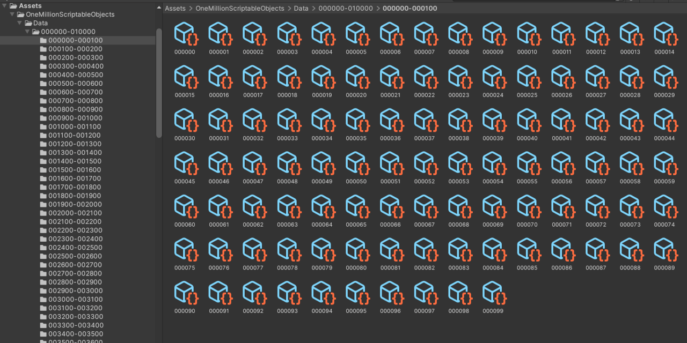

# One Million Scriptable Objects

*Test setup for Unity project with thousands of tiny scriptable objects*  

* [Unity Forum Thread](https://forum.unity.com/threads/webgl-builds-for-mobile.545877/)
* [Youtube Video Accelerator Memory impact](https://youtu.be/WyYpW5fwt3g)

This repo contains a script with which you can easily batch create scriptable objects. The main branch does not contain the created objects, but just the setup.

## License

* MIT (c) Johannes Deml - see [LICENSE](./LICENSE.md)